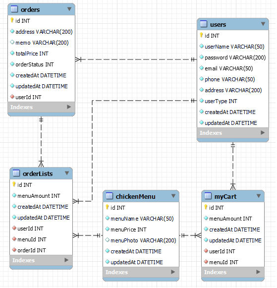

# 📌목차

1. [📄프로젝트 설명](#-프로젝트-설명)
2. [📚기술 스택📚](#-기술-스택-)
3. [👥멤버](#-멤버)
4. [🏗️ERD](#%EF%B8%8F-erd)

# 📄 프로젝트 설명

### 정기치킨 E-Commerce 토이 프로젝트

#### 고객과 사장님은 치킨을 사고 팔 수 있으며, 관리자는 모두를 관리할 수 있다.

[아프니까 2정기 팀 노션](https://plump-ice-e55.notion.site/B-2-6b6be56f5a5d4047878fbc0243d787bc) 

# 📚 기술 스택 📚

### ⭐ Platforms & Languages ⭐

### Front End

### Back End

  

### ☁️ AWS ☁️

### 🛠️ Tools 🛠️

  

# 👥 멤버

# 🏗️ ERD

